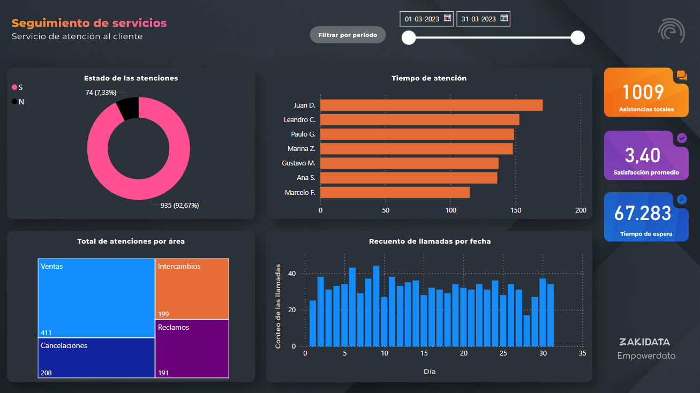

# Mi segundo informe en Power BI (Acelerador)

## Explicación

El dashboard de seguimiento de servicio proporciona información sobre el estado de las atenciones técnicas realizadas por un call center en un periodo determinado [5]. Las principales métricas que se observan en el informe son las siguientes:

- **Estado de las atenciones**: La mayoría de las atenciones se encuentran en estado "OS" (74), lo que significa "Orden de Servicio". Esto indica que la atención aun se encuentra en curso o sin resolver.

- **Agentes**: Se identifican tres agentes que atendieron solicitudes durante el periodo ("Juan D.", "Leandro C." y "Paulo G.").

- **Satisfacción promedio**: La satisfacción promedio de los clientes es de 3.40 sobre 5, lo que indica una calificación ligeramente positiva.

- **Total de llamadas por área**: El área de "Ventas" tiene la mayor cantidad de llamadas (411), seguida de "Intercambios" (199) y "Reclamos" (208).

- **Tiempo de espera**:  El informe no permite identificar claramente el tiempo promedio de espera de los clientes.

- **Conteo de llamadas por fecha**:  El gráfico inferior derecho permite observar variaciones en la cantidad de llamadas recibidas a lo largo del mes. No se puede determinar una tendencia estacional clara a partir de la imagen.

En conclusión, el dashboard proporciona una visión general de la actividad del servicio técnico durante el periodo analizado. Se observa que la mayoría de las atenciones se encuentran aun sin resolverse y el área de "Ventas" registra la mayor cantidad de llamadas. Si bien la satisfacción del cliente es ligeramente positiva, sería importante indagar en las causas de las calificaciones más bajas para identificar potenciales áreas de mejora.

Para un análisis más profundo, sería recomendable segmentar la información por agente o por tipo de servicio para identificar posibles cuellos de botella o variaciones en la calidad del servicio.

